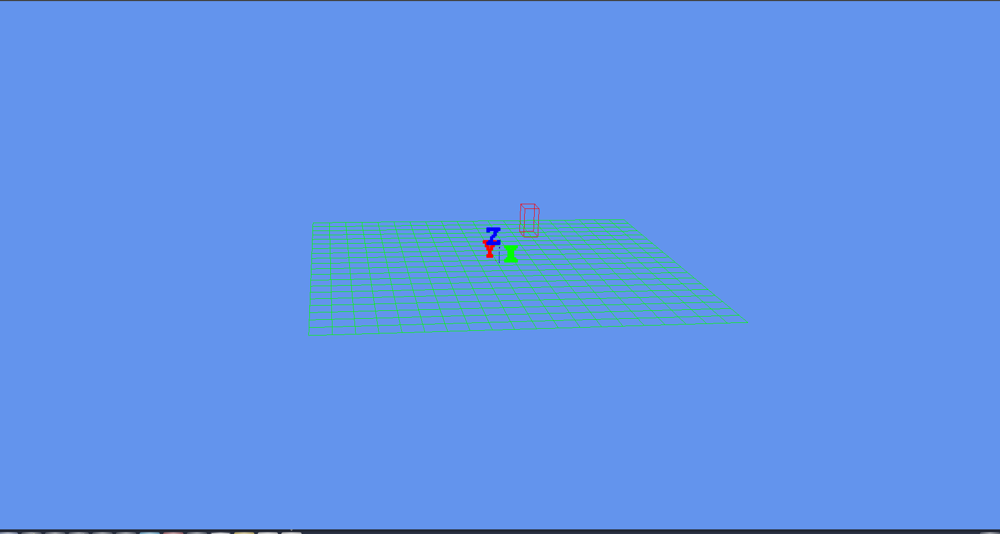

# 自动驾驶系统的可视化

qt作为交互界面，open scene graph作为可视化API.

# 依赖
* ubuntu 16.04
* qt 5.5.1 (sudo apt-get install qt5-default)
* eigen
* google test 1.11.0
* glog 0.50
* benchmark 1.6.0
* openscenegraph 3.6.4
* Lanelet2 (直接使用cmake编译不了，需要手动更改一些路径)
* Boost 1.58
* c++ 14
* pugixml 1.11.4
* geographiclib 1.45-2

# opengl
- [LearnOpenGL-CN github 链接](https://github.com/LearnOpenGL-CN/LearnOpenGL-CN)
- [LearnOpenGL-CN docs 链接](https://learnopengl-cn.github.io/)

## 

# 高精地图

地图的实际数据格式无关紧要，只要该格式可以无损地传输到内部表示即可。基于这个原则，对于open drive格式的地图，这种基于参考线的地图有着不少缺点。比如：
1. 将道路参数化的过程本身是复杂的。
2. 真实世界的道路是难以使用参数曲线来精确表示的，如果真的强行表示，会存在数据的损失。
3. 这种基于偏移量的道路表示法，在基线的航向变化大或者基线的曲率太大，那么偏移量的还原计算是失真的。
4. 求道路基线的过程本身就存在的数据损失。
5. 道路边界对于偏移量和基线非常敏感，这2者有稍微的变化，道路边界就会有很大的变化。
    
总而言之，基于参考线的道路表示法在数据的存储过程中和还原过程中，可能会存在着数据损失，并且一部分
数据对对另一些数据的的稍微变化非常敏感，所以这种地图格式不是很好。所以我选择了Lanelet2这种无损的数据
格式地图。

## Lanelet2
- [Lanelet2介绍](http://www.xchu.net/2020/02/25/42lanelet2-codeparsing/)

## 坐标系
- [地理坐标系,投影坐标系](https://zhuanlan.zhihu.com/p/379610875)

# 开发建议
禁止使用boost相关的代码，兼容性太差了，经常编译不了
